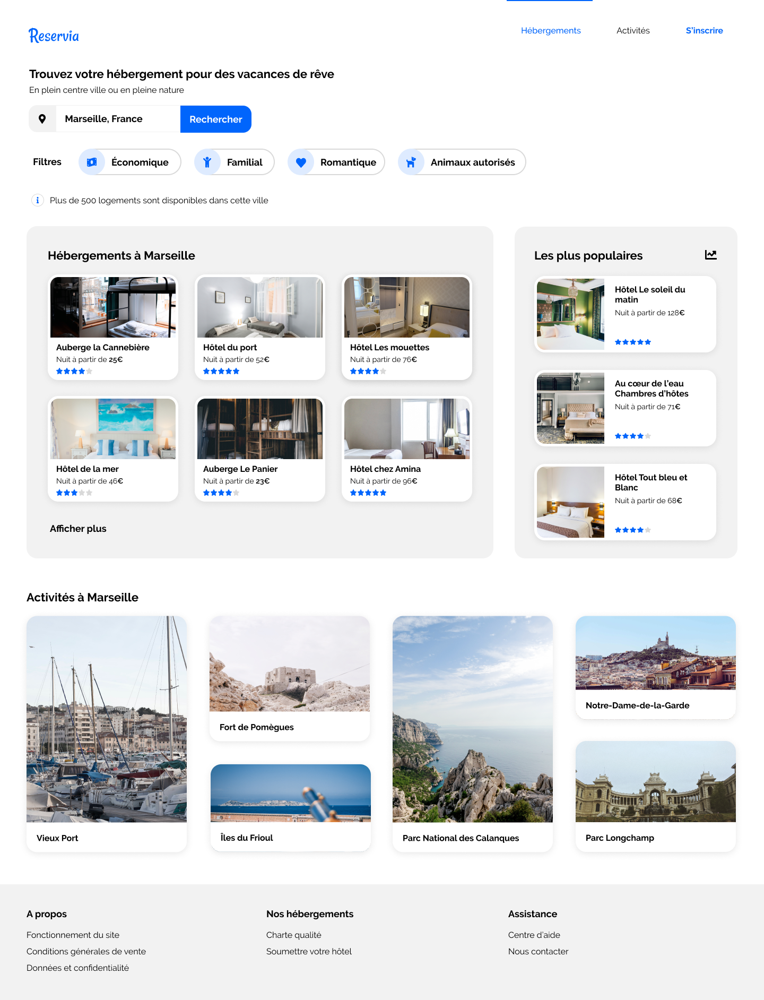

# RESERVIA
Projet 2 : implémentation de la maquette Reservia en HTML et CSS responsive

Reservia un site d'hébergement et d'activités dans la ville de son choix

## Éléments fournis

- Maquettes : desktop et mobile
- Images : différents formats
- Icônes : utilisation de Font Awesome
- Couleurs charte graphique : bleu #0065FC, bleu claire #DEEBFF, fond gris #F2F2F2
- Police Google Fonts  : Raleway

## Fonctionnalités

- Champs de recherche éditable par l'usager, il ne sera pas encore fonctionnel
- les cartes " Hébergements " et " Activités " sont cliquables dans son intégralité 
- Dans le menu, " Hébergements " et " Activités " sont des ancres
- Les filtres changent d'apparence au survol, ils ne seront pas encore fonctionnels

## Contraintes techniques

- Utilisation de Framework ou pré-compilateur non recommandé pour ce projet
- Utilisation de Visual Studio Code
- Séparation HTML et CSS
- Utilisation indispensable des balises sémantiques
- Validation avec W3C
- Compatible avec les Chrome et Firefox
- Travailler dès le début avec Git et Github

